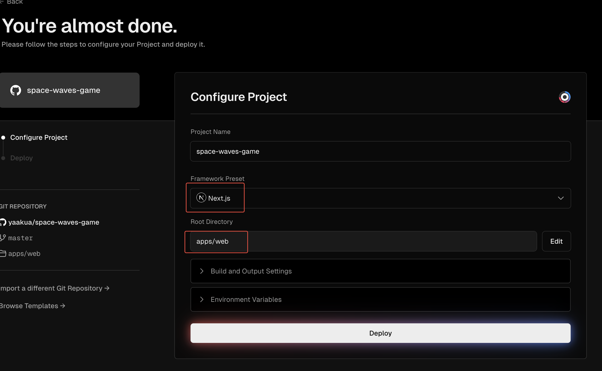

# Development Notes
- Links must use the project's specified component for automatic internationalization
```
import {Link} from "@repo/i18n/navigation"
```
- By default, the current template code only has content in English. If you need to translate to other languages, first register an account on Volcano Engine, obtain the Doubao model's API key and model name, then replace the DOUBAO_API_KEY and DOUBAO_MODEL_NAME variables in apps/web/.env
- Then run `bun run translate` command to automatically translate the en.json file to other languages

# Content to Replace for New Game Development
- Replace game_screenshot.webp image in apps/web/public
- Use the prompt below (Website Logo Design Prompt) to generate an SVG logo directly in Cursor using Claude. Save as logo.svg in apps/web/public directory
- Use [Logo.surf](https://logo.surf/) to generate ico and icon files
  - Select desired colors and fonts on the website, ico only needs two letters
  - The downloaded files will include apple-touch-icon.png and favicon.ico, directly replace apps/web/app/favicon.ico and apps/web/app/apple-touch-icon.png
- Replace the domain name in apps/web/app/sitemap.xml with the actual domain
- Modify UE_WEB_URL in apps/web/.env.production and apps/web/.env.runtime.production to the actual domain
- Modify name\gameIframe\domain\gaId in apps/web/lib/config/site.ts
  - name is the game name, which will also be used for translation
  - gameIframe is the game link, needs to be updated if the game updates
  - domain is the actual domain, used for Plausible user behavior data collection
  - gaId is the Google Analytics ID
- Use the prompt below (Project Copy Change Prompt) to regenerate content for en.json file
- After completing en.json file:
  - Run bun run clean-locales command to clean other language files in messages directory (needed first time only)
  - Run bun run translate command to translate content to other languages

## Deployment Notes
- Submit code to GitHub private repository, then connect to vercel.com and deploy
- For first import, need to modify:
  - Frameworks to Next.js to avoid errors
  - Root Directory to apps/web
  - Modify build command to `cd ../.. && turbo run build --filter='*'` to avoid errors

- When binding domain, choose to redirect www to @
- Configure CNAME and A records in Cloudflare, A record points to vercel.app IP address
| Record Type | Name | Value |
|-------------|------|-------|
| CNAME | www | cname.vercel-dns.com |
| A | spacewavesgame.online | 76.76.21.21 |

- When binding domain in Cloudflare, set custom SSL to Full (Strict) to avoid too many redirects issue
- If iframe embedding is not allowed, find another that can be embedded
- After Vercel deployment, submit for indexing at search.google.com\bing.com

## Docker Private Deployment
- Build command needs to add --network=host, otherwise will show Prisma file download failure

## Project Copy Change Prompt
```
I'm developing a new game called "Escape Road". Please refill the content in this en.json file based on the copy materials I provide about this game. The en.json file content is used for internationalization in desc.tsx and home.tsx components. Please analyze and generate appropriate copy content based on the structure of these two components.

Notes:
1. Ensure the highest word density for the game name "Escape Road" by increasing its frequency where appropriate.
2. Generated copy must come from the content I provide, no making things up.
3. First understand the meaning and purpose of the original copy, then find suitable content from the provided materials to replace it (goal is to maintain the original webpage structure while updating with new content)

Provided copy content:

